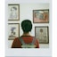

## index.html
```
<!DOCTYPE html>
<html lang="en">
<head>
    <meta charset="UTF-8">
    <meta name="viewport" content="width=device-width, initial-scale=1.0">
    <title>Dribbble Clone</title>
    <link rel="stylesheet" href="styles.css">
</head>
<body>
    <header>
        <nav>
            <div class="logo">Dribbble</div>
            <ul>
                <li><a href="#">Sign Up</a></li>
                <li><a href="#">Log In</a></li>
            </ul>
        </nav>
        <div class="header-content">
            <h1>Discover the world’s top designers & creatives</h1>
            <p>Dribbble is the leading destination to find & showcase creative work and home to the world's best design professionals.</p>
            <a href="#" class="cta">Sign up</a>
        </div>
    </header>

    <!-- First Gallery -->
    <section class="gallery-section">
        <button class="gallery-nav prev" onclick="scrollGallery('gallery1', -200)">&#10094;</button>
        <div class="gallery" id="gallery1">
            <div class="gallery-item"></div>
            <div class="gallery-item"></div>
            <div class="gallery-item"></div>
            <div class="gallery-item"></div>
            <div class="gallery-item"></div>
            <div class="gallery-item"></div>
            <div class="gallery-item"></div>
            <div class="gallery-item"></div>
        </div>
        <button class="gallery-nav next" onclick="scrollGallery('gallery1', 200)">&#10095;</button>
    </section>

    <!-- User Profiles -->
    <section class="profiles">
        <div class="profile-grid">

            <div class="profile-item">
                
                <p class="profile-name">User 1</p>
            </div>
            <!-- Repeat similar profile-item divs for other users up to 49 items (7 rows * 7 columns) -->
            <!-- Example for 2nd user -->
            <div class="profile-item">
                
                <p class="profile-name">User 2</p>
            </div>
            <!-- Add more profile items here -->
            <div class="profile-item">
                
                <p class="profile-name">User 2</p>
            </div>

            <div class="profile-item">
                
                <p class="profile-name">User 2</p>
            </div>

            <div class="profile-item">
                
                <p class="profile-name">User 2</p>
            </div>

            <div class="profile-item">
                
                <p class="profile-name">User 2</p>
            </div>

            <div class="profile-item">
                
                <p class="profile-name">User 2</p>
            </div>

            <div class="profile-item">
                
                <p class="profile-name">User 2</p>
            </div>

            <div class="profile-item">
                
                <p class="profile-name">User 2</p>
            </div>

            <div class="profile-item">
                
                <p class="profile-name">User 2</p>
            </div>

            <div class="profile-item">
                
                <p class="profile-name">User 2</p>
            </div>

            <div class="profile-item">
                
                <p class="profile-name">User 2</p>
            </div>

            <div class="profile-item">
                
                <p class="profile-name">User 2</p>
            </div>

            <div class="profile-item">
                
                <p class="profile-name">User 2</p>
            </div>
    </section>

    <!-- Second Gallery -->
    <section class="gallery-section">
        <button class="gallery-nav prev" onclick="scrollGallery('gallery2', -200)">&#10094;</button>
        <div class="gallery" id="gallery2">
            
            <div class="gallery-item"></div>
            <div class="gallery-item"></div>
            <div class="gallery-item"></div>
            <div class="gallery-item"></div>
            <div class="gallery-item"></div>
            <div class="gallery-item"></div>
            <div class="gallery-item"></div>
        </div>
        <button class="gallery-nav next" onclick="scrollGallery('gallery2', 200)">&#10095;</button>
    </section>

    <footer>
        <p>&copy; 2024 Dribbble Clone. All rights reserved.</p>
    </footer>
    <script src="script.js"></script>
</body>
</html>
```
## styles.css
```
* {
    margin: 0;
    padding: 0;
    box-sizing: border-box;
}

body {
    font-family: Arial, sans-serif;
    line-height: 1.6;
    background-color: #f5f5f5;
    color: #333;
}

header {
    background-color: #fbff00;
    color: rgb(0, 132, 255);
    padding: 20px 0;
    text-align: center;
}

nav {
    display: flex;
    justify-content: space-between;
    align-items: center;
    padding: 0 20px;
}

nav .logo {
    font-size: 24px;
    font-weight: bold;
    
}

nav ul {
    list-style: none;
    display: flex;
}

nav ul li {
    margin-left: 20px;
}

nav ul li a {
    color: rgb(7, 241, 249);
    text-decoration: none;
}

.header-content {
    max-width: 600px;
    margin: 40px auto;
}

.header-content h1 {
    font-size: 36px;
    margin-bottom: 10px;
}

.header-content p {
    font-size: 18px;
    margin-bottom: 20px;
}

.header-content .cta {
    display: inline-block;
    padding: 10px 20px;
    background-color: white;
    color: #180e9b;
    text-decoration: none;
    border-radius: 5px;
}

.gallery-section {
    display: flex;
    align-items: center;
    justify-content: center;
    margin: 20px 0;
    position: relative;
}

.gallery {
    display: flex;
    overflow-x: hidden;
    scroll-behavior: smooth;
    padding: 20px;
}

.gallery-item {
    min-width: 200px;
    min-height: 150px;
    margin: 10px;
    overflow: hidden;
    border-radius: 10px;
}

.gallery-item img {
    width: 100%;
    height: 100%;
    object-fit: cover;
    border-radius: 10px;
}

.gallery-nav {
    background: none;
    border: none;
    font-size: 24px;
    cursor: pointer;
    position: absolute;
    top: 50%;
    transform: translateY(-50%);
}

.prev {
    left: 0;
}

.next {
    right: 0;
}

.profiles {
    padding: 20px;
}

.profile-grid {
    display: grid;
    grid-template-columns: repeat(7, 1fr);
    gap: 10px;
    justify-content: center;
}

.profile-item {
    text-align: center;
}

.profile-pic {
    width: 100px;
    height: 100px;
    object-fit: cover;
    border-radius: 50%;
    margin-bottom: 10px;
}

.profile-name {
    font-size: 14px;
    font-weight: bold;
}

footer {
    background-color: #333;
    color: white;
    text-align: center;
    padding: 10px 0;
}
```
## output

